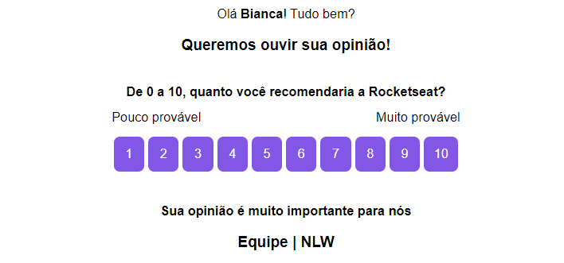

<h1 align="center">NLW#4 | Nodejs</h1>

<div align="center">

  
  
  
  
  
  <p>Project developed during the Nodejs trail in 4th edition of Next Level Week, created by Rocketseat.</p>
</div>

## 💻 Rest API for NPS (Net Promoter Score)

This project is a back-end application that consists of calculating the company's NPS. In it, we register users, register surveys, send e-mail to users to answer satisfaction surveys and with this we can perform the NPS calculation.

The Net Promoter Score is a type of metric created to measure customer satisfaction, as: "From 0 to 10, how much you recommend our company?"

<div align="center">
  
</div>

## :woman_technologist: Technologies and tools used:

- Typescript
- Nodejs
- Express
- SQLite
- TypeORM (data manipulation)
- Jest (automated testing)
- Nodemailer (sending survey email)
- Handlebars

## 🚀 How to run the project?

Before start, install [Git](https://git-scm.com), [Node.js](https://nodejs.org/en/) and [Yarn](https://classic.yarnpkg.com/en/docs/install/#windows-stable) on your machine.<br>
Moreover, recommend use the [VSCode](https://code.visualstudio.com/) terminal.

```bash
# Clone this repository
$ git clone https://github.com/cunhasbia/nlw4-nodejs.git

# Access the repository on your terminal
$ cd nlw4-nodejs

# Install dependencies
$ yarn install

# Run
$ yarn dev

# The API will be running on port 3333
```
<hr>

Made with :purple_heart: by Bianca Cunha | Find me on [LinkedIn](https://www.linkedin.com/in/biancascunha)
